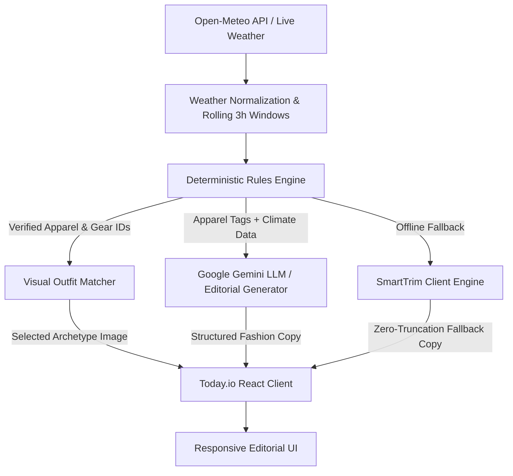

# Today.io (Weather_Pro)

> An editorial, fashion-conscious weather lifestyle application translating real-time meteorological forecasts into practical, stylish wardrobe and gear advisories.

[](https://www.typescriptlang.org/)
[](https://react.dev/)
[](https://vitejs.dev/)
[](https://ai.google.dev/)
[](LICENSE)

---

## Overview

Most weather apps focus on raw meteorology—barometric pressure, dew points, and humidity charts. **Today.io** reframes the daily forecast around the question users actually want answered: **"What should I wear, and what do I need to carry today?"**

By bridging meteorological data with editorial fashion styling, Today.io delivers:
- **Wear & Pack Advisories**: Actionable recommendations for tops, bottoms, footwear, outerwear, and accessories.
- **Visual Outfit Hero**: Studio photography dynamically matching 9 calibrated climate archetypes (from Hot/Sunny linen to Cold Rain technical shells).
- **Hybrid Copy Generation**: Deterministic rule-based item curation paired with Google Gemini GenAI for rich editorial microcopy and tone.
- **Predictive 3-Hour Timeline**: An uncrowded, scrollable 24-hour timeline with temperature-mapped color stops.
- **Conversational Weather Assistant**: Interactive context chips and natural language Q&A ("Can I skip the jacket?", "What if I'm out all day?").

---

## System Architecture



### Key Technical Highlights

1. **Deterministic Rules Engine**: Analyzes compound conditions (peak temperatures, 3h rolling precipitation curves, UV index, wind speeds, WMO condition codes) to evaluate 30+ apparel and accessory items without hallucination risk.
2. **Dynamic Photography Selection**: Maps compound conditions and verified wear items to 9 studio visual scenes:
   - `hot_sunny`: Cotton boxy tee, tailored linen shorts, slides, angular sunglasses
   - `warm_rain`: Clear PVC raincoat open over tee/shorts, rain boots, matte umbrella
   - `mild_clear`: Charcoal crewneck, cropped trousers, chunky derbies
   - `cool_overcast`: Slate washed hoodie, relaxed denim, combat boots
   - `cold_dry`: Heavy charcoal overcoat, beanie, oatmeal scarf
   - `cold_rain`: Waterproof trench shell, knit sweater, umbrella, boots
   - `snow_freezing`: Cropped puffer parka, snow pants, lug-sole winter boots
   - `windy_transitional`: Cropped nylon windbreaker, wide cargo pants, sneakers
   - `high_sun_arid`: Linen long-sleeve, linen trousers, wide-brim hat, woven mules
3. **Boundary-Aware Copy Formatting (`smartTrim`)**: Enforces spatial constraints beside fixed 246px icon containers, terminating copy strictly at complete sentence boundaries (`. `, `! `, `? `) or clean word delimiters to eliminate mid-word cutoffs.
4. **Automated Visual Regression Auditing**: Employs Chrome DevTools Protocol (CDP) headless scripts to capture and verify mobile (390x844) and desktop (1440x900) layout geometry.

---

## Tech Stack

- **Frontend**: React 18, TypeScript, Tailwind CSS, Lucide Icons, Vite
- **AI / LLM**: Google Gemini API (`gemini-1.5-flash` / `gemini-pro`) with structured JSON schema responses
- **Backend / Proxy**: Node.js, Express (API rate-limiting, CORS, secure key management)
- **Data Source**: Open-Meteo Geocoding & Weather Forecast API
- **Testing & Tooling**: Chrome DevTools Protocol (CDP), ESLint, Vite Build Optimizer

---

## Getting Started

### Prerequisites
- Node.js 18+
- pnpm or npm

### Installation

1. **Clone the repository:**
   ```bash
   git clone https://github.com/CarbonDesignWorld/Weather_Pro.git
   cd Weather_Pro
   ```

2. **Install dependencies:**
   ```bash
   npm install
   ```

3. **Configure Environment Variables:**
   Create a `.env` file in the root directory:
   ```env
   GEMINI_API_KEY=your_gemini_api_key_here
   PORT=3000
   ```

4. **Run Development Servers:**
   ```bash
   # Start backend API proxy
   node server.js

   # In another terminal, start Vite dev server
   npm run dev
   ```

5. **Build for Production:**
   ```bash
   npm run build
   npm run preview
   ```

---

## License

MIT License © 2026 Today.io contributors.
