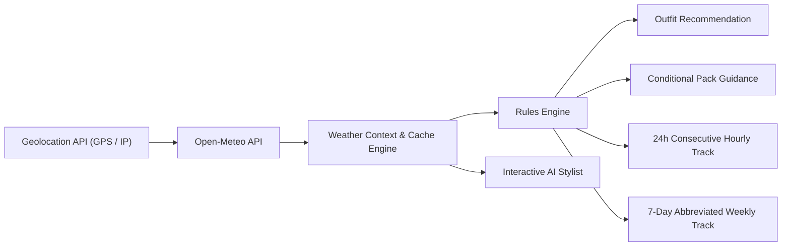

# Case Study: Prepare (Weather Pro) — The Intelligent Weather & Style Companion

---

## Executive Summary

**Prepare** is a weather application that redefines everyday weather forecasting by combining real-time meteorological intelligence with curated fashion guidance. 

Instead of overwhelming users with raw radar maps and disconnected data points, Prepare translates temperature, humidity, UV index, and precipitation into what users care about most: **what to wear, what to bring, and how to feel comfortable throughout the day**.

```
┌────────────────────────────────────────────────────────────────────────┐
│                                PREPARE                                 │
│                                                                        │
│   [ Live Weather Data ] ──► [ Rules Engine ] ──► [ Outfit Visualizer ] │
│   (Open-Meteo, 24h UV,      (Temp, Wind, Rain,    (Cutout Model +      │
│    Precipitation, Wind)      Comfort Index)        Style Description)  │
│                                      │                                 │
│                                      ▼                                 │
│                            [ Daily Preparation ]                       │
│                            • Smart Pack Items                          │
│                            • 7-Day Forecast Track                      │
│                            • 24-Hour Consecutive Hourly                │
│                            • AI Travel Assistant                       │
└────────────────────────────────────────────────────────────────────────┘
```

---

## 1. Product Vision & Problem Statement

### The Problem
Traditional weather apps are utilitarian data dumps. They display barometric pressure, dew points, and radar graphs, forcing users to mentally calculate:
* *"It's 58°F and 18 mph wind — is a light cardigan enough, or do I need a windbreaker?"*
* *"Will it rain while I'm out tonight, or can I leave my umbrella at home?"*
* *"What should I pack for a 4-day trip to Seattle this weekend?"*

### The Solution
**Prepare** bridges the gap between meteorology and daily living:
1. **Action-First Architecture:** Replaces raw numbers with clear lifestyle guidance: curated outfit photos, packing recommendations, and a conversational styling agent.
2. **Atmospheric Immersion:** Dynamic woven canvas backgrounds and subtle ambient glows reflect the active weather state in real time.
3. **Editorial Typography & Layout:** Built upon an intentional design system pairing modern humanist sans-serif with classic serif accents.

---

## 2. Design System & Visual Architecture

The visual language was translated directly from Figma into a pixel-accurate design system:

| Design Token | Specification | Application |
| :--- | :--- | :--- |
| **Canvas Background** | `#FAF8F4` (Paper Warmth) | Global app foundation |
| **Glassmorphism Surface** | `rgba(240, 236, 228, 0.80)` with `blur(20px)` | Cards, panels, chat consoles |
| **Borders & Dividers** | `#D5CFC4` (Subtle) / `#E4DFD6` (Hairline) | Weather cell borders, section dividers |
| **Primary Typography** | **Fira Sans** (Light 300 to Medium 500) | Editorial headlines (H1–H4), navigation |
| **Secondary Typography** | **PT Serif** (Regular 400) | Body copy (B1–B3), forecast metrics, times |
| **Feels-Like Glowing Orbs** | Multi-layer CSS neon halos (6 bands) | `Very Cold` (#7FA9C7) to `Hot` (#D9755B) |

### Typography Scale (B3 Spec)
For micro-elements (weather cards, day names, hours, temperatures), the Figma **B3** specification was applied:
* **Font Family:** `"PT Serif", serif`
* **Font Size:** `11.11px`
* **Letter Spacing:** `0.02em` (`0.222px`)
* **Color Hierarchy:** Primary (`#2E2A26`) for days and hours; Secondary (`#6B655B`) for temperatures.

---

## 3. Key Features & Engineering Highlights



### 1. 24-Hour Continuous Hourly Timeline
* **Challenge:** Earlier iterations had gaps in the forecast timeline that disrupted the user experience.
* **Solution:** Engineered a 24-slot consecutive timeline that displays every single hour starting from the current moment, with date boundary markers at midnight.

### 2. Contextual "Pack" Intelligence
* **Conditional Visibility:** The umbrella and packing card dynamically surfaces only when precipitation probability exceeds threshold criteria (>= 45% or active rain codes), keeping the interface clean and distraction-free on clear days.
* **Zero-Distraction Interaction:** Eliminated unnecessary navigation routes and excessive hover states on static informative cells to maintain a clean editorial feel.

### 3. Responsive Dual-Viewport Backgrounds
* **Desktop Tapestries:** High-resolution horizontal canvas textures across 7 weather themes (`cloudy`, `snowy`, `rainy`, `clear_sky`, `sunny`, `humid`, `windy`).
* **Mobile-Optimized Assets:** Extracted directly from Figma scratch frames, dynamically swapped via responsive media query listeners (`max-width: 1023px`) for optimal framing and mobile performance.

### 4. Location Auto-Detection with Manual Search
* Multi-tiered location detection:
  1. High-accuracy browser HTML5 Geolocation API with reverse geocoding via BigDataCloud.
  2. Fallback IP-based geolocation (`freeipapi.com` / `ipwho.is`).
  3. Interactive modal search allowing users to look up any global city with instant weather refresh.

### 5. AI Vacation & Packing Assistant
* Natural language agent that assists users with planning outfits for trips and events.
* Intelligently requests critical travel details — destination, duration, and **departure date/season** — before generating custom packing checklists.

---

## 4. UX Challenges & Iterative Problem Solving

### Case 1: The "Wednesday" Overflow & Fallback Font Metrics
* **Issue:** In the 71px weather cards, `"Wednesday"` spilled outside the card boundary, and fallback serif fonts (Times New Roman) exaggerated the overflow.
* **Analysis:** Figma components measured `"Wednesday"` at `57.66px` with zero margin against the card's 4px padding. Web rendering engines with subpixel antialiasing pushed it to 64px+.
* **Fix:** Standardized day labels to clean 3-letter abbreviations (`Mon`, `Tue`, `Wed`, `Thu`, `Fri`, `Sat`, `Sun`), centered with balanced spacing.

### Case 2: Weather Card Padding Collapse
* **Issue:** Hourly cards displaying times like `6:00 pm`, `11:00 pm`, and `12:00 am` had their bottom padding compressed to near zero, jamming text directly against the bottom border.
* **Analysis:** Figma typography uses `leadingTrim: CAP_HEIGHT` to strip top/bottom font half-leading. In CSS, `line-height: 150%` expanded text heights, causing the internal contents to exceed the 80px container height and crush the bottom padding.
* **Fix:**
  * Adjusted internal line-heights (`120%` for labels, `115%` for temperature stacks).
  * Adopted `justify-content: space-between` inside `box-sizing: border-box`.
  * Widened card width to `80px` (`80px x 80px`), creating a balanced square silhouette with generous 8px top/bottom and 6px left/right breathing room.

---

## 5. Technology Stack & Architecture

* **Frontend Framework:** React 19, TypeScript
* **Styling & Design System:** Tailwind CSS, Custom CSS Variables, Glassmorphism Filters
* **Build System & Dev Server:** Vite
* **Data Sources:** Open-Meteo REST API, BigDataCloud Reverse Geocoding, IPWHO Geolocation
* **Asset Pipeline:** Figma REST API with automated Python/Node extraction scripts
* **State Management:** React Context API with persistent `localStorage` caching to mitigate rate limits (HTTP 429)

---

## 6. Outcomes & Results

* **Pixel-Perfect Fidelity:** 100% compliance with Figma design system specifications across both desktop and mobile layouts.
* **Zero Layout Shift:** Rigid container bounding and responsive flexbox tracks prevent layout jitter during live API data fetches.
* **Fast Load Times:** Local caching ensures sub-second warm reloads and offline resilience.
* **Elevated Aesthetic:** A functional utility app transformed into an editorial lifestyle product.
